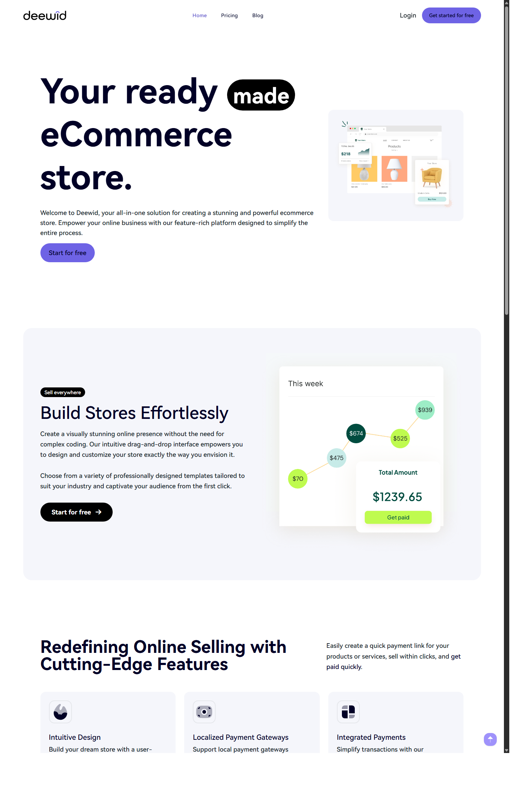
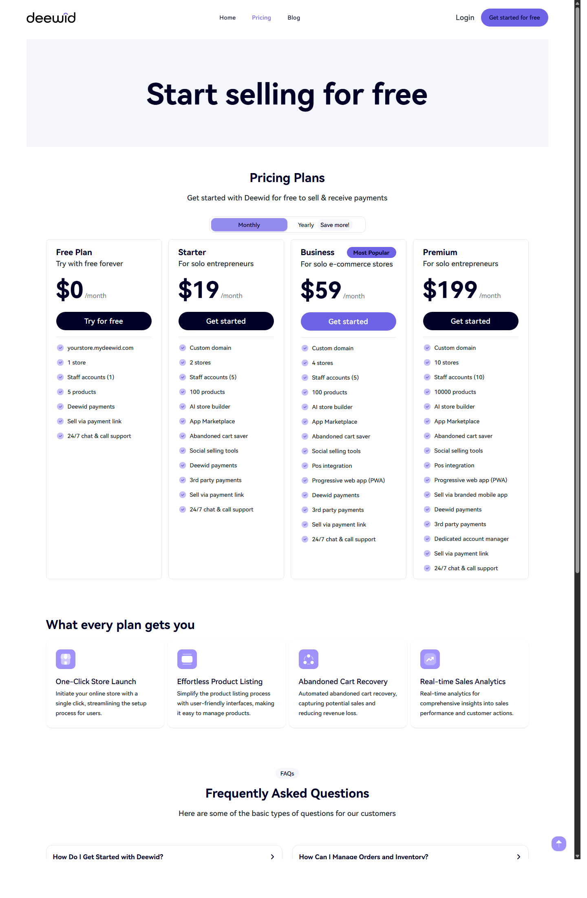

# Deewid Landing V3 Laravel

Laravel version of Deewid. This repository extends the static front-end versions into a Laravel 11 application base with Livewire.

## Preview




## Scope

- Deewid landing rendered with Blade
- `home`, `pricing`, `company`, `blog`, `store-not-found`, and `store-unavailable` pages
- Laravel application base for future product work
- reserved application routes for `deewid-landing-v3-laravel.adrielzimbril.com`

## Stack

- Laravel 11
- PHP 8.2+
- Livewire 3
- Vite
- Tailwind CSS

## Development

```bash
composer install
npm install
cp .env.example .env
php artisan key:generate
php artisan serve
```

In a second terminal:

```bash
npm run dev
```

For a production-ready check:

```bash
npm run build
php artisan test
```

## Notes

- The app domain uses `DEEWID_APP_DOMAIN` from `.env`.
- The current public V3 URL is `https://deewid-landing-v3-laravel.adrielzimbril.com/`.

## Render

- The repository includes `Dockerfile`, `.dockerignore`, `render-start.sh`, and `render.yaml`.
- The Docker runtime is aligned to PHP 8.4 to match locked dependency requirements.
- `APP_KEY` and `DATABASE_URL` must be configured in Render.

## Deewid versions

- `deewid-landing-v1`
  Repo: `https://github.com/adrielzimbril/deewid-landing-v1`
  Preview: `https://adrielzimbril.github.io/deewid-landing-v1/`
- `deewid-landing-v2`
  Repo: `https://github.com/adrielzimbril/deewid-landing-v2`
  Preview: `https://adrielzimbril.github.io/deewid-landing-v2/`
- `deewid-landing-v3-laravel`
  Repo: `https://github.com/adrielzimbril/deewid-landing-v3-laravel`
  Live app: `https://deewid-landing-v3-laravel.adrielzimbril.com/`

## Maintainer

Maintained by Oricodes.

- Website: `https://www.oricodes.com/`
- GitHub: `https://github.com/adrielzimbril`

## License

MIT. See `LICENSE`.
